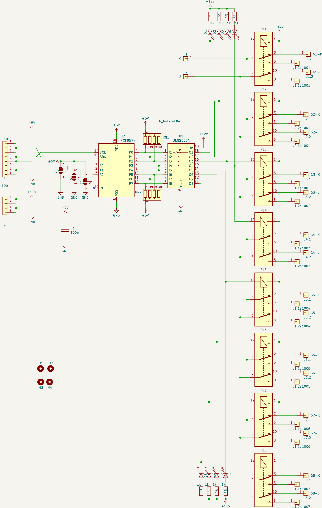
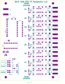

# Beschreibung

8-fach Relaisplatine, die über i²c angesteuert wird. Die Relais werden dabei über eine separate Spannung versorgt.

Die I²C-Adresse muss durch entsprechende Brücken bei A0 - bis A2 ausgeält werden. Die Grundadresse des PCF 8475 ist 0x40 und de
ie des PCF 8475 ist 0x70.

Die LEDs leuchten, wenn die Relais in Ruhe sind. 

Der Interrupt-Pin ist herausgezogen, aber nicht weiter beschaltet.

# Schaltplan

# Bestückungsplan

