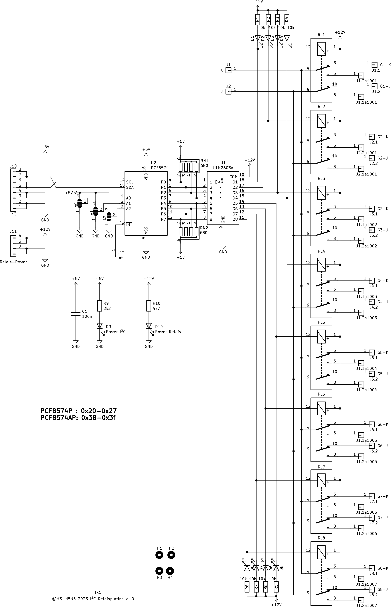

# Beschreibung

8-fach Relaisplatine, die über I²C angesteuert wird. Die Relais werden dabei über eine separate Spannung versorgt.

Die I²C-Adresse muss durch entsprechende Brücken bei A0 - bis A2 ausgeält werden. Die Grundadresse des PCF 8475 ist 0x40 und de
ie des PCF 8475 ist 0x70.

Die LEDs bei den Relais leuchten, wenn die Relais in Ruhe sind. Des weiteren gibt es zwei Power-LEDs, einmal für die 5V vom I²C und einaml für die 5/12V der Relais.

Der Interrupt-Pin ist herausgezogen, aber nicht weiter beschaltet.

# Schaltplan

# Bestückungsplan

